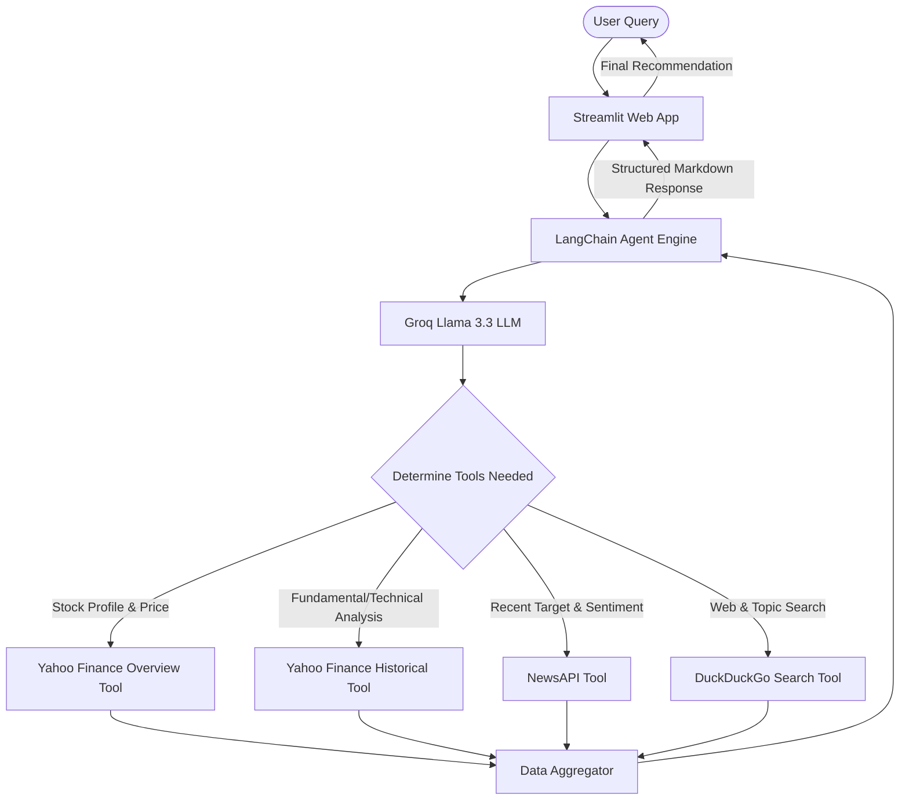

# 📈 AI Stock Analyzer

<p align="center">
  <strong>An Intelligent agentic financial assistant powered by LangChain, Groq LLMs, Yahoo Finance, and Real-Time Web Search.</strong>
</p>

<p align="center">
  
  
  
  
  
</p>

---

## 🚀 Overview

**AI Stock Analyzer** is a state-of-the-art financial analysis companion that translates natural language queries into deep, real-time stock insights. Combining fundamental and technical stock metrics with the latest market sentiments via search APIs, it equips you with structured data and AI-guided opinions to help you make informed decisions.

Whether you ask *"Should I buy Nvidia?"*, *"Compare Apple vs Tesla"*, or *"What is the latest news on Microsoft?"*, the AI Stock Agent performs real-time data aggregation, technical trend evaluation, and news lookup before providing a clear, structured recommendation.

---

## ✨ Features

- 📊 **Real-Time Data Aggregation:** Fetches live pricing, 52-week ranges, trading volumes, and target prices using **Yahoo Finance (`yfinance`)**.
- 🧠 **Agentic AI Reasoning:** Utilizes **LangChain Agents** paired with the **Groq Llama-3.3-70b-versatile** model for high-speed, logical reasoning.
- 🔍 **Live Sentiment & Web Search:** Uses a dual news engine (**NewsAPI** & **DuckDuckGo Search**) to query recent events, press releases, and general market sentiments.
- 📈 **Fundamental & Technical Indicator Analysis:** Automatically extracts valuation metrics (P/E ratio, EPS, ROE, Debt/Equity, Free Cash Flow) and evaluates 3-month momentum (uptrend/downtrend).
- 💻 **Premium Dark-Theme Web UI:** Features a custom CSS-injected, modern dark-mode **Streamlit** dashboard designed for a clean chat experience.
- 📋 **Structured Reports:** Returns highly readable insights using a standardized layout covering Stock Summary, Quick Insights, Recent News, Analysis, and clear Buy/Hold/Sell advice.

---

## 🛠 Tech Stack

| Technology | Logo / Reference | Purpose |
| :--- | :--- | :--- |
| **Python** | `Python 3.10+` | Core execution environment |
| **Streamlit** | `stApp Dark Theme` | Interactive, responsive web interface |
| **LangChain** | `Agent / Tools` | Orchestrating agent flow, prompt templates, and tool calls |
| **Groq Cloud** | `llama-3.3-70b` | Ultra-fast LPU inference for LLM responses |
| **yFinance** | `Yahoo Finance` | Fetching real-time market indicators and historical price series |
| **NewsAPI & DuckDuckGo** | `Search APIs` | Fetching live news and articles to assess market sentiment |
| **Dotenv** | `python-dotenv` | Secure local configuration and environment variable loading |

---

## 🏗 System Architecture

The following diagram illustrates how your queries flow through the Streamlit interface, the LangChain reasoning agent, and the various financial/web API tools.



---

## 📂 Project Directory Structure

```bash
STOCK_ANALYZER/
│
├── .venv/                  # Python Virtual Environment (ignored by Git)
├── Notebook.ipynb          # Jupyter Notebook for prototyping agent tools and prompts
├── requirements.txt        # Python package dependencies
├── Stock_Analyzer.py      # Core LangChain agent setup, custom tools, and prompt definitions
├── app.py                  # Streamlit Web App with custom CSS styling and chat loop
├── README.md               # Project documentation (this file)
└── .env                    # Local environment variables containing API keys (User-Created)
```

---

## ⚙️ Setup & Installation

Follow these steps to run the AI Stock Analyzer locally on your machine.

### 1. Prerequisites
Ensure you have **Python 3.10** or higher installed.

### 2. Clone the Repository
Navigate to your desired directory and open a terminal:
```bash
git clone <your-repository-url>
cd STOCK_ANALYZER
```

### 3. Create and Activate a Virtual Environment
It is highly recommended to run the app inside a virtual environment to manage dependencies:

* **Windows (PowerShell):**
  ```powershell
  python -m venv .venv
  .venv\Scripts\Activate.ps1
  ```
* **macOS / Linux:**
  ```bash
  python3 -m venv .venv
  source .venv/bin/activate
  ```

### 4. Install Dependencies
Install all required Python libraries:
```bash
pip install -r requirements.txt
```
*(Note: To launch the web UI, you also need Streamlit installed: `pip install streamlit`)*

### 5. Configure Your API Credentials (Two Options)

The AI Stock Analyzer supports two convenient configuration methods:

#### Option A: Interactive Browser Onboarding (Recommended)
You do not need to create files manually! Simply launch the application (`streamlit run app.py`). The app will display an elegant startup dashboard in your browser where you can paste your **Groq API Key** and **News API Key** directly. Once connected, your workspace session activates instantly.

#### Option B: Local Environment Configuration (.env)
If you prefer to save your keys permanently so they are pre-filled automatically on every application reload, create a file named `.env` in the root folder of the project:
```env
GROQ_API_KEY=your_groq_api_key_here
NEWS_API=your_news_api_key_here
```
* **Groq API Key:** Obtain from the [Groq Console](https://console.groq.com/).
* **News API Key:** Obtain from [NewsAPI.org](https://newsapi.org/).

---

## 🚀 How to Run

You can interact with the project in three different ways:

### A. Run the Interactive Web UI (Streamlit)
Launch the beautiful, custom dark-themed web browser interface:
```bash
streamlit run app.py
```
This will start a local server, typically open at `http://localhost:8501`.

### B. Run the CLI Prototype
Execute the standalone agent script directly from the terminal. It includes a built-in query test in the main method:
```bash
python Stock_Analyzer.py
```

### C. Prototyping Notebook
Open `Notebook.ipynb` in VS Code, JupyterLab, or Google Colab to experiment with prompt styling and tool definitions.

---

## 💬 Sample Queries

Here are a few questions you can ask the agent in the chat:
* *"Analyze Apple's stock performance and let me know if it's a good buy."*
* *"What is the current trend for NVIDIA stock? Check any relevant news from the last 24 hours."*
* *"Compare Tesla (TSLA) fundamental metrics vs Google (GOOGL)."*
* *"Give me the latest financial overview and recommendations for Microsoft."*

---

## 📊 Standardized Response Template

The agent is optimized to deliver reports in the following precise format:

```markdown
📈 **Stock Summary**
- **Ticker:** AAPL
- **Current Price:** $178.50
- **Trend:** Increasing (Uptrend based on 3-month moving average)

💡 **Quick Insight**
- Apple is showing strong momentum with robust revenue growth, although its trailing PE is relatively high compared to industry peers.

📰 **Recent News**
- Apple announces new AI integration partnerships, boosting market sentiment across technical sectors.

🔬 **Analysis**
- **PE Ratio:** 29.5
- **EPS:** $6.13
- **ROE:** 154%
- **Debt to Equity:** 140%
- **Free Cash Flow:** Strong liquidity with $20B+ cash flow.

⚠️ **Advice**
- **Hold**
- **Reason:** While fundamental health remains stellar, the current price is near its 52-week high. Waiting for a minor pullback offers a safer entry point. *(Disclaimer: This is not professional financial advice.)*
```

---

## ⚠️ Disclaimer

> [!WARNING]
> **This application is for educational and informational purposes only.** The analyses, trends, and opinions generated by the AI Stock Analyzer do not constitute professional financial advice, investment recommendations, or endorsement to buy, sell, or hold any securities. Always perform your own research and consult with a certified financial advisor before making any financial decisions.

---

## 📄 License

This project is licensed under the MIT License - see the LICENSE file for details.